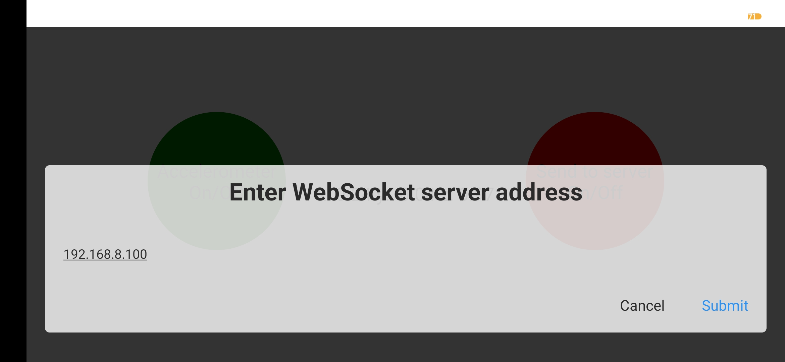
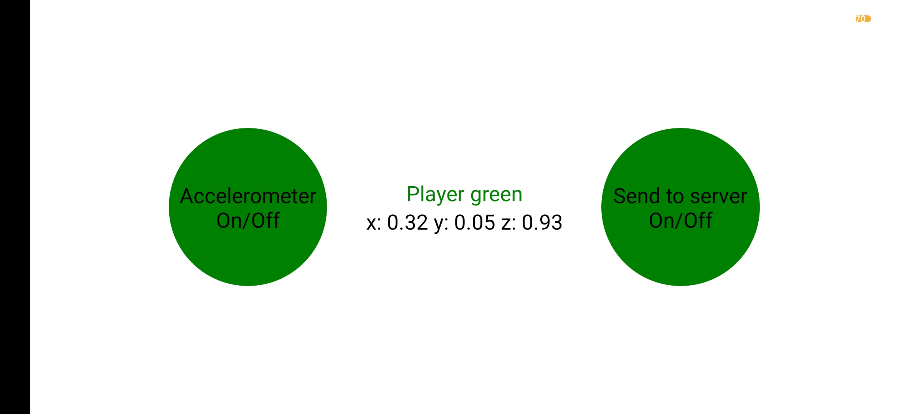
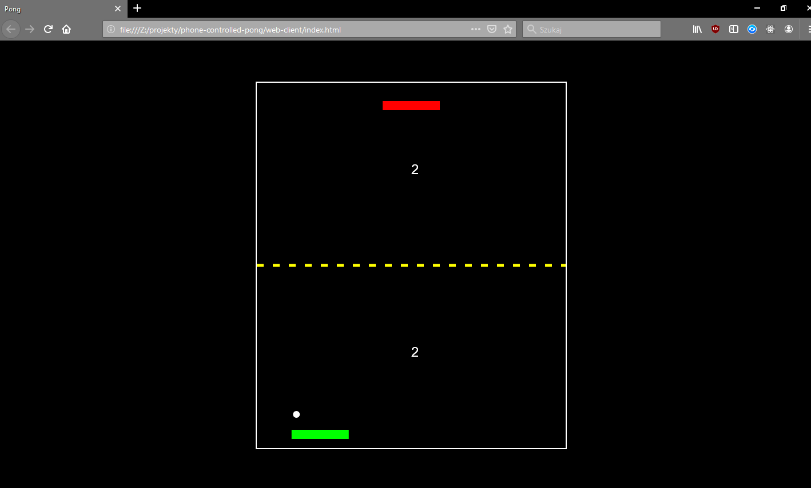

# phone-controlled-pong
Pong game in browser controlled by player's phone accelerometer. 

How it works
------------

* Browser client which renders the game connects to the Node.js server from where it gets the data from the mobile apps
* Mobile apps made with React Native and Expo connect and send accelerometer data to the Node.js server
* Node.js server forwards data from the mobile apps to the browser client 
* All communication is taking place via WebSockets

How it looks
------------

